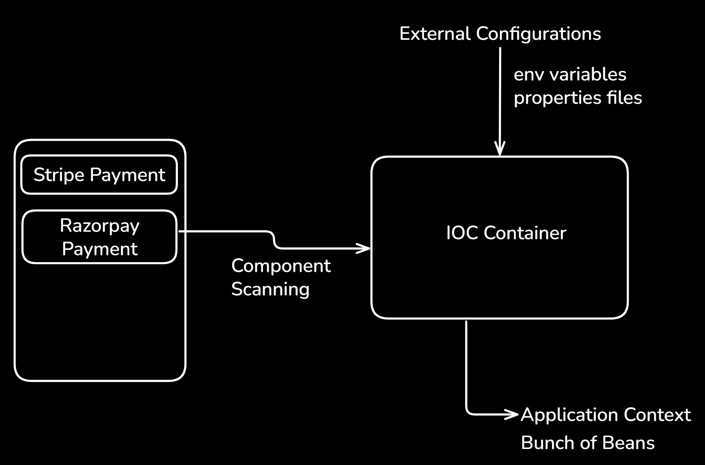

# Notes

## Dependancy Injection and Beans
- A Bean is a class whose object is created and controlled by the Spring IoC (Inversion of Control) container.
- Dependency Injection is a design pattern where one object receives the objects it depends on from the Spring container instead of creating them itself.

```java
private final RazorpayPaymentService paymentService = new RazorpayPaymentService();
```
this is code is tigtly coupled i.e. in future if we want to implement PhonePe, then it will involve major changes for that
de-coupling is necessary
- For that we have a concept dependancy injection and beans
- Beans are the java objects that are managed by the spring containers
- we give the @Component annotation
- Advantage we avoid tight coupling

```java
@Component
public class RazorpayPaymentService {

    public String pay(){
        String payment = "Razorpay payment";
        System.out.println("Payment from: "+ payment);
        return payment;
    }

}
// This all can work as a bean
// @Service
// @RestController
// @Controller
// @Repository
```

## Constructor dependancy injection
```java
//constructor dependancy injection	
// spring does this
public LearningSpringBootAppApplication(RazorpayPaymentService paymentService){
    this.paymentService = paymentService;
}
```

## Field Injection
- we use the keyword @Autowired to make it field injection
```java
@Autowired
private RazorpayPaymentService paymentService;
```

## What if we make two components (beans)
- Suppose we implemented a StripePayment class and wrote the logic for stripe payment, we will write the @Component annotation as well since we want this class as a bean as well.
- An error will rise stating
```bash
Description:

Parameter 0 of constructor in com.springboot.prep.learningSpringBootApp.LearningSpringBootAppApplication required a single bean, but 2 were found:
	- razorpayPaymentService: defined in file [D:\DevPrep\Backend\Backend_prep\SpringBoot\learningSpringBootApp\learningSpringBootApp\target\classes\com\springboot\prep\learningSpringBootApp\RazorpayPaymentService.class]
	- stripePaymentService: defined in file [D:\DevPrep\Backend\Backend_prep\SpringBoot\learningSpringBootApp\learningSpringBootApp\target\classes\com\springboot\prep\learningSpringBootApp\StripePaymentService.class]
```

This means the spring is now confused because there are two beans, so it says you can make one of them as a primary bean.
We can remove @Component from Razorpay, which means RazorpayPaymentService will no longer be handled by spring.

Earlier when annotation was in Razorpay and we removed that
we will get the output
```bash
Payment from: Stripe payment
Stripe payment
```

## Bean creation using conditions
If we remove the @Component from any of the payment classes it's not a good practice rather
we can command spring to create beans based on conditions
we define **payment.provider = razorpay** in **application.properties**

```java
payment.provider = razorpay
```

we use a annotation which tells the spring that take the value of payment.provider from application.properties and if it create the beans according to the value.
```java
@ConditionalOnProperty(name="payment.provider", havingValue="razorpay")
```



# Component Scanning
- It starts from the @SpringBootApplication Annotation i.e. present in the root file fo the application
- 