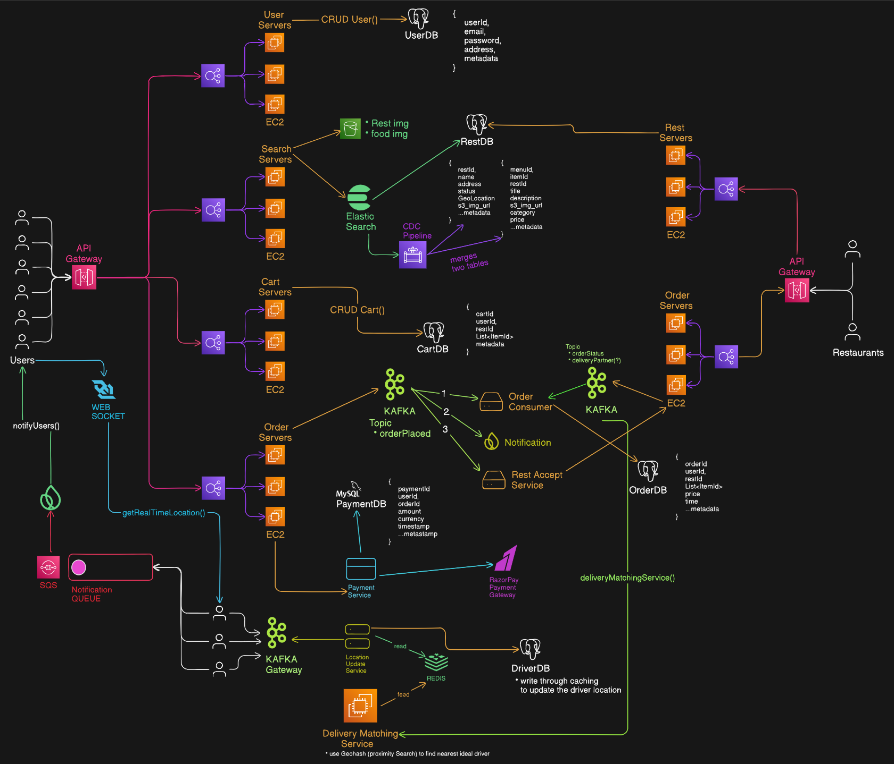
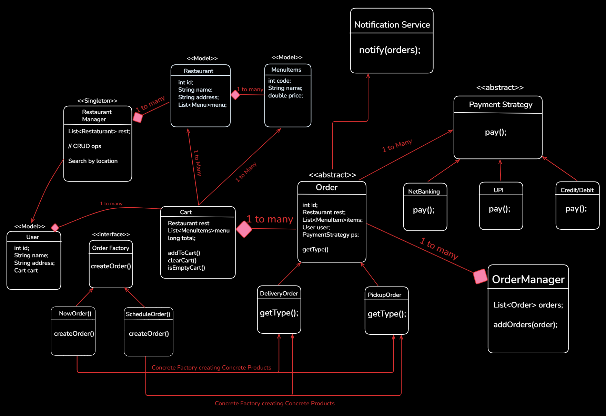

# Design a Food Delivery App
- Online platoform that allows users to search restaurants and order food online form them

# High Level Design

# Low Level Design

# Functional Requirements
- User should be able to register into our application
- List down all the nearby restaurants based on user location
- User should able to search restaurants based on title and menu
- Shows all the menu in the display of the restaurants
- User should able to select various item(s) in the cart and make the payment to confitm order from nearest restaurant
- Once the restairann accept, find nearby delivery partner based on driver location, optimsed delivery time
- Once the delivery partner pickup the order, give almost real time location of delivery partner to user
- User should get notificatin on all stages and get past orders in the profile.

# Non-Functional Requirements
- Scale: 50M users and 1M restaurants
- CAP Theorem: Application should be highly available based on searching and out application should be highly consistent based on payments abd irder of food from restaurant.

# Identify Core Entity
- User
- Restaurants
- FoodMenu
- Delivery Agent/Partner
- Payment

# API Designing
- POST : /v1/user/register {PostBody : userMetaData} + (login/logout/update)
- GET : /v1/restaurants/nearby?lat={lat}&lon={lon}&rad={rad} -> List<RestaurantId (Partial)> : Pagination
- GET : /v1/restaurants/search?title={title}&menuItem={item} -> List<RestaurantId (Partial)> : Pagination
- GET : /v1/restaurants/{restId} -> Restaurant metadata
- GET : /v1/restaurants/{restId}/menu -> List of foodItems available

- POST : /v1/restaurants/{PostBody : itemId + qty + restId} + (update/delete) : returns cartId (userId -> sent in header)
- POST : /v1/orders {PostBody : orderId} : return orderId
- POST : /v1/payment {PostBody : paymentMetaData + orderId} : returns paymentID
- GET : /v1/delivery/{orderId}/tracking : Delivery metaData
